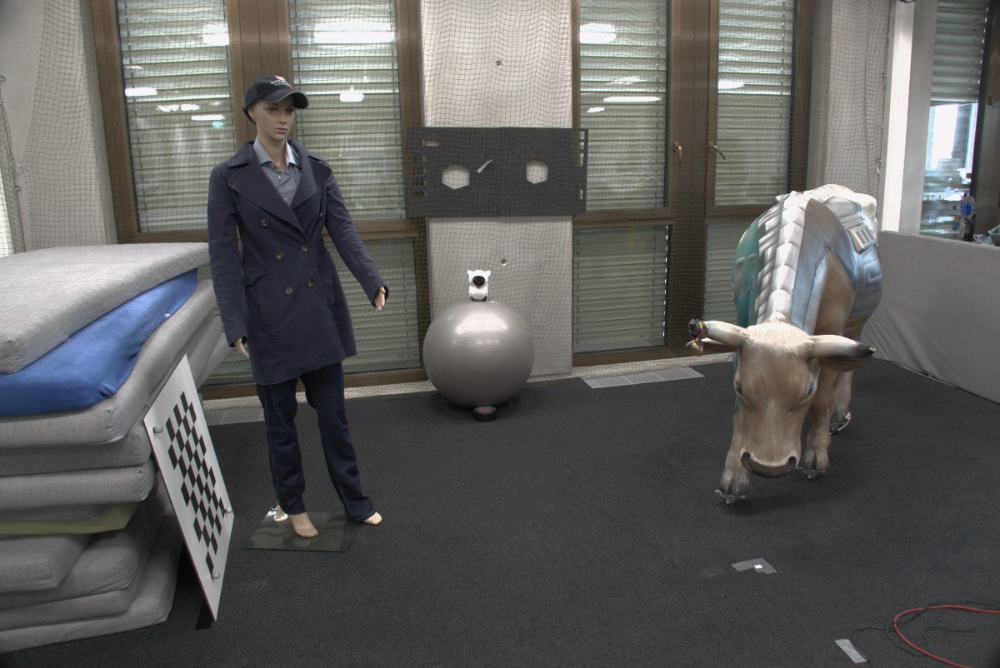
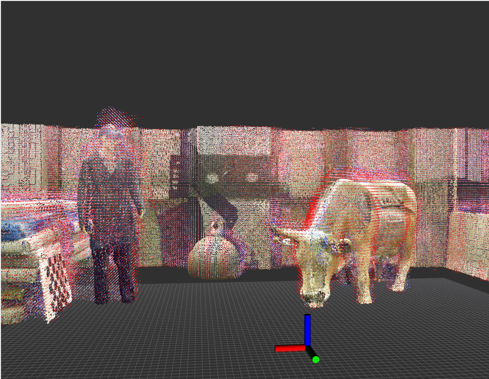
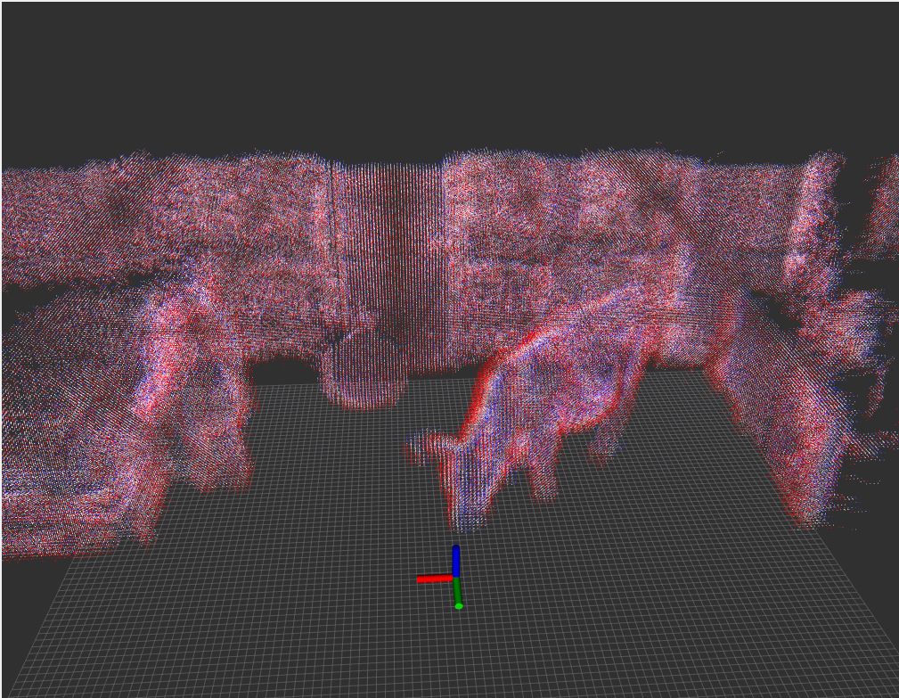

# tsdf_kernel
Example of kernel code to perform tsdf mapping running n GPU, which works with OpenCL 1.2.

## Test On ETH ASL Voxblox RGBD Dataset
[Dataset Link](https://projects.asl.ethz.ch/datasets/doku.php?id=iros2017)
The data was gathered with a Kinect 1, and a photograph of the original scene can be seen below:

For this test voxel resloution is 2.5cm and truct dist set as 5cm.
For better visualiztion, points from red->white->blue represents tsdf value from -1.0 to 1.0.
### Mapping result compare to groundtruth

### Different Angle Of Mapping result

